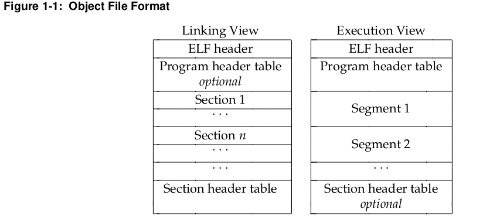

# Executable and Linkable Format (ELF)
- Executable and Linking Format (ELF) được phát triển và công bố bởi USL (UNIX System Laboratories) như là một phần của ABI (Application Binary Interface).  
- Ủy ban TIS (Tool Interface Standards) đã chọn chuẩn ELF làm định dạng đối tượng di động (portable object ) chạy trên môi trường kiến trúc Intel 32-bit cho nhiều hệ điều hành. 
---
## OBJECT FILES
### Introduction
- Có 3 loại object files:
    - **A relocatable file:** chứa code và dữ liệu phù hợp để liên kết với những object file khác tạo nên executable file hay shared object file.  
    - **An executable file:**  chứa chương trình phù hợp để thực thi
    - **A shared object file:** chứa code và dữ liệu phù hợp cho liên kết 2 context: 
        - Một là link editor có thể xử lý nó với những file khác và shared object file để tạo ra object file mới.  
        - Hai là dynamic linker kết nối nó với 1 file thực thi (executable file) và những shared object khác để tạo ra một process image.  
Được tạo bởi assembler và link editor, object file dạng biểu diễn nhị phân nhằm thực thi chương trình trực tiếp trên CPU.

**File Format**  
- Object file tham gia vào xây dựng chương trình (program linking) và thực thi chương trình (program executed). Do đó, để thuận tiện và hiệu quả, object file format cung cấp nhiều cách nhiều ở các góc độ khác nhau, tùy thuộc vào những yêu cầu cụ thể.
  
- ELF header nằm ở vị trí bắt đầu của file, mô tả cấu trúc, tổ chức của têp tin.
- Section giữ phần lớn thông tin tệp của các đối tượng, xem ở dạng liên kết: instruction, data, symbol table, relocation information, ...
- Program header table (nếu tồn tại) chịu trách nhiệm nói cho hê điều hành biết làm sao để tạo môt process image. Những files dùng để xây dựng process image bắt buộc phải có program header table.  
- Section header table chứa thông tin mô tả file's sections. Mỗi section có một entry trong table, và mõi entry sẽ chứa những thông tin như: tên section, kích thước,... Những file được sử dụng trong quá trình linking thì phải có cùng section header table.  
**Data Representation**  
- Như nói ở trên, Object file format hỗ trợ các bộ xử lí khác nhau với kiến trúc 4 bytes, 32 bits. HƠn nữa, nó có xu hướng mở rộng đến các kiến trúc lớn hơn (hoặc nhỏ hơn). Do đó, object file trình bày một số control data với format độc lập với máy tính để có thể xác định object files và thông dịch nôi dung của chúng một cách chung nhất. Phần dữ liệu còn lại trong object files sử dụng mã hóa của bộ xử lí đích (target processor).  
- Tất cả những cấu trúc dữ liêu được định dạng trong file object đều phải tuân theo nguyên tắc căn chỉnh (alignment guidelines) và kích thước "tự nhiên" cho những lớp liên quan. Nếu cần thiết, ta sử dụng những byte đệm (padding) để đảm bảo sự căn chỉnh, và dữ liệu cần phải đươc căn chỉnh phù hợp ngay từ đầu file.

### ELF Header    
- Chứa kích thước thực của object file.  
- Khi cấu trúc object file thay đổi thì hệ thống sẽ tính lại control struct.  

### Sections
### String Table
### Symbol Table
### Relocation