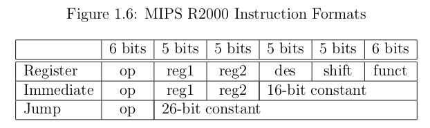

#	**MIP SUMMARIZE**
This paper is the summarization of EN-MIPS_Assembly_Tutorial.pdf on root-me  
by Daniel J. Ellard
---
##	**Data Representation**  
1. **Representing Integers**  
- *Unsigned Binary Numbers*
	- 	**Conversion of Binary to Decimal**
		- Let X be a binary number, n digits in length composed of bits X<sub>n-1</sub> ... X<sub>0</sub>  
		- Let D be a decimal number.
		- Let i be a counter.
		1.	Let D = 0
		2.	Let i = 0
		3. 	While i < n do:
			- If X<sub>i</sub> == 1, then set D = (D + 2<sup>i</sup>)
			- Set i = (i+1)
	- 	**Conversion of Decimal to Binary**
		-	Let X be an unsigned binary, n digits in length
		-	Let D be a positive decimal number, no larger than 2<sup>n</sup> - 1  
		-	Let i be a counter
		1. Let X = 0 (set all bits in X to 0).
		2.	Let i = (n-1)
		3.	While i >= 0 do:
			a. 	If D>= 2<sup>i</sup>, then
				- Set X<sub>i</sub>=1
				- Set D = (D - 2<sup>i</sup>)
			b.	Set i = (i - 1)
	-	**Addition of Unsigned Binary Numbers**
		- Let A and B be a pair of n-bit binary numbers.  
		- Let X be a binary number which will hold the sum of A and B.
		- Let c and c^ be carry bits
		- Let i be a counter.
		- Let s be an integer.
		1.	Let c = 0.
		2.	Let i = 0.
		3.	While i < n do:
			a.	Set s = A<sub>i</sub> + B<sub>i</sub> + c
			b.	Set X<sub>i</sub> and c^ according to following rules:
				- If s == 0, then X<sub>i</sub> = 0 and C^ = 0
				- If s == 1, then X<sub>i</sub> = 1 and C^ = 0
				- If s == 2, then X<sub>i</sub> = 0 and C^ = 1
				- If s == 3, then X<sub>i</sub> = 1 and C^ = 1
			c.	Set c = c^
			d.	Set i = i + 1
- *Signed Binary Numbers*
	-	**Negation of a two's complement number**  
		1. Let -x = the logical complement of x
			The logical complement (also called the one's complement) is formed by flipping all the bits in the number, changing all iof the 1 bits to 0, and vice versa.
		2.	Let X = -x + 1
		If this addition overflows the over bit is discarded
	- Some of useful properties:
		- The lefmost (most significant) bit also serves as a sign bit; if 1, then the number is negative, if 0, then the number is positive or zero.
		- The rightmost (least significant) bit of a number always determines whether or not the number is odd or even - if bit 0 is 0, then the number is even, otherwise the number is odd.
		- The largest positive number that can be represented in two's complement notation in an n-bit binary number is 2<sup>n-1</sup> - 1.
		- Similarly, the "most negative" number is -2<sup>n-1</sup>, so if n = 8, then it is 10000000, which is -2<sup>7</sup> = 128. Note that the negative of the most signitive number (in this case, 128) cannot be represented in this notation.
	- **Addition and Subtraction of Signed Binary Numbers**
		- If A and B are of the same sign, but A + B is of the opposite sign, then an overflow or wraparound error has occured.
		- If A and B are of different signs, then A + B will never overflow or wraparound.  
	- **Shifting Signed Binary Numbers**
		- To multiply a number by two, shift the number "up" (to left) by one bit, placing a 0 in the least significant bit..
		- To divide a number in half, shift the number "down" (to the right) by one bit (don't change the sign bit)
2. **Representing Characters.**
	- ASCII which stands for the **American Standard Code for Information Interchange**, uses 7-bit integers to represent characters.  
	- One problem is that the character set only defines the representations of the characters used in written English. This causes problems with using ASCII to represent other witten languages.  
3.	**Representing Programs**

	- The first six bits of each instruction are called the op field which determines whether the instruction is register, immediate, or jump instrution, and how the rest of the instruction should be interpreted.
	- Depending on what the op is, parts of the rest of the instruction may represent the names of register, constant memory addresses, 16-bit integers, or other additional qualifiers for the op. 
	- If the op field is 0, then the instruction is a register instruction.
	- If the op field is not 0, then the instructin may be either an immediate or jump instruction, depending on the value of the op field.

---

##	**MIPS Tutorial**
1.	**What is Assembly Language**
	- Assembly language is very closely related to machine languae, and there is usually a straightforward way to translate programs written in assembly language into machine language.  
2.	**Getting Started:**
	- 	[Syscall, using syscall and Reading and Printing Integers](./Sources/add.asm)
	-	[Strings: the hello Program](./Sources/hello.asm)
	-	Conditional Execution: the larger Program
		- This is a program that will read two numbers from the user, and print out the larger of the two.  
		[larger.asm](./Sources/larger.asm)
	-	Looping: The multiples Program
		- This program will read two numbers A and B, and print out multiples of A from A to A x B.
		- Algorithm
		```
		1. 	Get A from the user
		2.	Get B from the user. If B <= 0, terminate.
		3.	Set sentinel value S = A x B
		4.	Set multiple m = A
		5.	Loop:
			(a)	Print m
			(b)	If m == S, then go to the next step
			(c) Otherwise, set m = m + A, and then repeat the loop
		6. Terminate
		```
		Program: [multiple.asm](./Sources/multiples.asm)
	- Loads:	The palindrome.asm Program
		- This program will read a line of text and determine whether or not the text is a palindrome.
		- Algorithm
		```
		1.	Let A = S
		2.	Let B = a pointer to the last character of S. To find the last character in S, use the following algorithm:
			(a) Let B = S
			(b)	Loop:
				- If *B == 0 (i.e. the character at address B is 0), then B has gone past the end of the string. Set B = B - 2 (to move B back past the 0 and the new line), and continue with the next step.
				- Otherwise, set B = (B+1).
		3. 	Loop:
			(a) If A >= B, then the string is a palindrome. Halt.
			(b)	If *A != *B, then the string is not a palindrome. 
			(c)	Set A = (A + 1)
			(d)	Set B = (B - 1)
		```
		- This program: [palindrome.asm](./Sources/palindrome.asm)
	- The atoi program
		These programs will read a line of text from terminal, interpret it as an integer, and then print it out.
		- Algorithm
		```
		- Let S be a pointer to start of the string.
		- Let D be the number.
		1. Set D = 0.
		2. Loop:
			(a) If *S == '\n', then continue with the next step.
			(b) Otherwise,
				i. 		S = (S+1)
				ii.		D = (D x 10)
				iii.	D = (D + (*S - '0'))
		```
		- Program: [atoi.asm](./Sources/atoi_1.asm)
3.	Function Environments and Linkage
- The information that describe the state of a function during execution (i.e. the actual parameters, the value of all of the local variables, and which statement is beging executed) is called the *environment* of the function
- For a MIPS assembly program, the environment of a function consists of the values of all the rigister that are referenced in the function. It uses the stack to store each of the environments.
- Before a fuction A calls function B, it pushes its enviromnent onto the stack, and then jumps to function B. When the function B returns, function A restores its environment by popping it from the stack.
	1. The **caller** must:
	```
	(a) Put the parameters into $a0-$a3. If there are more than four parameters, the additional parameters are pushed onto the stack.
	(b)	Save any of the caller-saved registers ($t0 - $t9) which are used by the caller
	(C)	Execute a jal (or jalr) to jump to the function.
	```
	2.	The *callee* must, as part of the function preamble:
	```
	(a) Create a stack frame, by subtracting the frame size from the stack pointer ($sp)
	(b)	Save any callee-saved registers ($s0-$s7, $fp, $ra) which are used by the callee. Note that the frame pointer ($fp) must always be saved. The return address ($ra) needs to be saved only by functions which make function calls themselves.
	(c)	Set the frame pointer to the stack pointer, plus the frame size.
	```
	3.	The **callee** then executes the body of the function
	4.	To return from a function, the **callee** must:
	```
	(a)	Put the return value, if any, into register $v0
	(b)	Restore callee-saved registers.
	(c)	Jump back to $ra, using the **jr** instruction 
	```
	5.	To clean up after a function call, the **caller** must:
	```
	(a) Restore the caller-saved registers.
	(b)	If any arguments were passed on the stack (instead of in $a0-$a3), pop them off of the stack
	(c)	Extract the return value, if any, from register $v0.
	```
- **Computing Fibonacci Numbers**
	- *Using Saved Registers:* 
		- This program will use callee-saved registers to hold all of the local variables.
		- [fib-s.asm](./Sources/fib-s.asm)
	- *Using Temporary Registers:* 
		- In the fib function in fib-s.asm, half of the function call are leaf calls. It is often unnecessary to go to all of the work of saving all of the reigster in each call to fib, since half the time fib doesn;t call itself again.
		- We can take advantage of this fact by using caller saved registers instead of callee saved registers. Since it is the responsibility of the caller to save these registers.
		- [fib-t.asm](./Sources/fib-t.asm)
	- *Optimization: fib-o.asm*
		- There are still more tricks we can try in order to increase the performance of this program. 
		- Half the calls to fib have an argument n of 1 or 0, therefore, do not need to do anything except return a 1, we can simplify the program considerably: this base case doesn't require building a stack frame, or using any registers except $a0 and $v0. Therefore, we can postpone the work of building a stack frame until after we're tested to see if we're going to do the base case.
		- We can further trum down the number of instructions taht are executed by saving fewer registers.
		- [fib-o.asm](./Sources/fib-o.asm)
- **Structures and sbrk: the treesort Program**
	- The treesort algorithm
	```
	1. 	Build an ordered binary tree T containing all the values to be sorted.
	2.	Do an inorder traversal of T, printing out the values of each node.
	```

	- Representing Structures
		- In C, we would use a definition:
		```c
		typedef	struct 	_tree_t {
				int 			val;	/* the value of this node. */
				struct 	_tree_t *left;	/* pointer to the left child. */
				Struct 	_tree_t *right; /* pointer to the right child. */
		} tree_t;
		```
		- In MIPS architecture it will require excatly three words (tweleve bytes) to represent this structure: 
			- a word to represent the val
			- Another for the left point
			- The last for the right pointer
		There fore, we can use a three-word chunk of memory to represent a node, as long as we keep track of what each word in the chunk represents  
		```assembly
			#	MIPS assembly:				C equivalent:
			lw	$s0, 0($t1)				# a = foo->val;
			lw 	$s1, 4($t1)				# b = foo->left;
			lw 	$s2, 8($t1)				# c = foo->right;

			sw 	$s0, 0($t1)				# foo->val = a;
			sw 	$s1, 4($t1)				# foo->left = b;
			sw 	$s2, 8($t1)				# foo->right = c;
		```

		- The sbrk syscall
			- There is a syscall named **sbrk** that can be used to allocated memory
			- The problrm with sbrk is taht it can only be used to allocate memory, neve to give it back