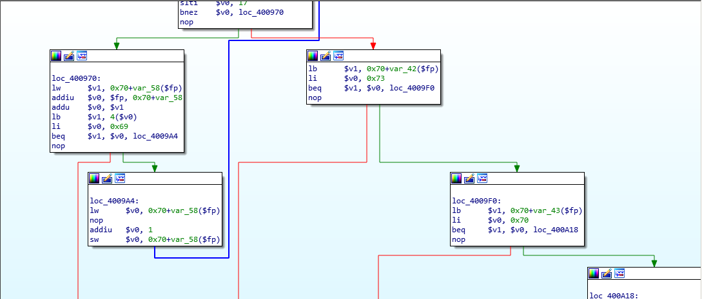
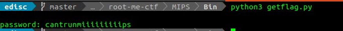

# Challenge ELF MIPS - Basic Crackme on root-me
you can download binary file in **[here](./Bin/ch27.bin)**  
I have summarized this tutorial of some file which is attached in root-me in **[here](./Mips_summarize.md)**

## LET'S GO
- First, I tried run this bin file. Unfortunately, this bin file hasn't run. I spent 1 weeks to find how to run it and I failed.
- After I decied get this password without run binary. Opening this file by IDA pro and read.

- You can see that:
	- The length of password is 19
	- It checks each of items in password with special number. So this is flag.
	- I wrote small script to get password in **[here](./Bin/getflag.py)**
  
Oh! Can't run mips :)  
So **password: cantrunmiiiiiiiiips**  